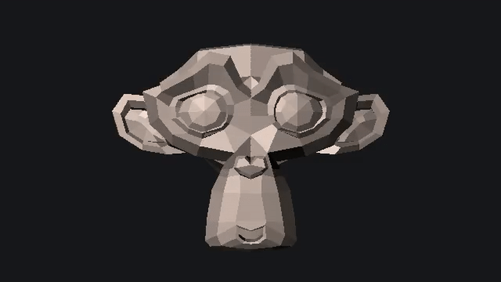

## BasicRaytracer


This is a standalone basic raytracer written in C without any library.  
The goal of this project is for me to learn the logic behind raytracing and to learn C programming language.  
It has been tested on ubuntu-20.

 Example render

### Roadmap

- [x] Command line interface
- [x] Use unittests
- [x] Directional lights
- [x] Reads obj geometry file
- [x] Outputs bmp image
- [x] Multithreading
- [x] Basic support for transform
- [ ] Smooth shading
- [ ] Support for multiple objects
- [ ] Shadows
- [ ] Blinn shader 

### Conventions
- Z up and y forward: Same as Blender.
- The units are in cm.

### References

- [Coding style](https://github.com/MaJerle/c-code-style)
- [Rendering theory: scratchapixel](https://www.scratchapixel.com/lessons/3d-basic-rendering)

### Installation
Gcc and Cmake are the only requirements for this project.
Follow the [INSTALL](INSTALL) for more information.

### Usage
```shell
.raytracerExperiment <objFile>
```
If no object file is given, an [example scene](examples/exampleScene.h) is rendered.
